# XISCAM (Xeovix Integrated Smart Camera) 

### **●  Introduction**
XISCAM is an Integrated Smart Camera sub-project of 'Industrial HATs for Raspberry Pi' which we're developing.

According to the different applications in the field of industry, business, science and education. The XISCAM has 2 models, the Primary and Professional. 

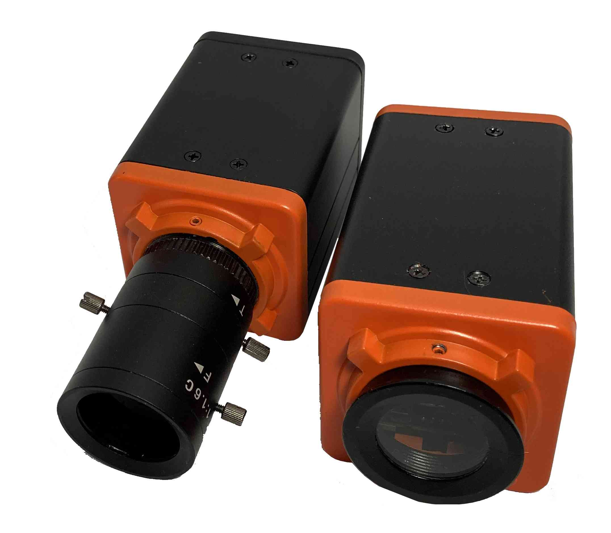

The Primary model is for education and research, the power source is only support 5V DC. The Professional model support 12~24V DC power source. It is most convenient for the usage of industry and automatics.                 

The XISCAM is combined by 3 major parts, 

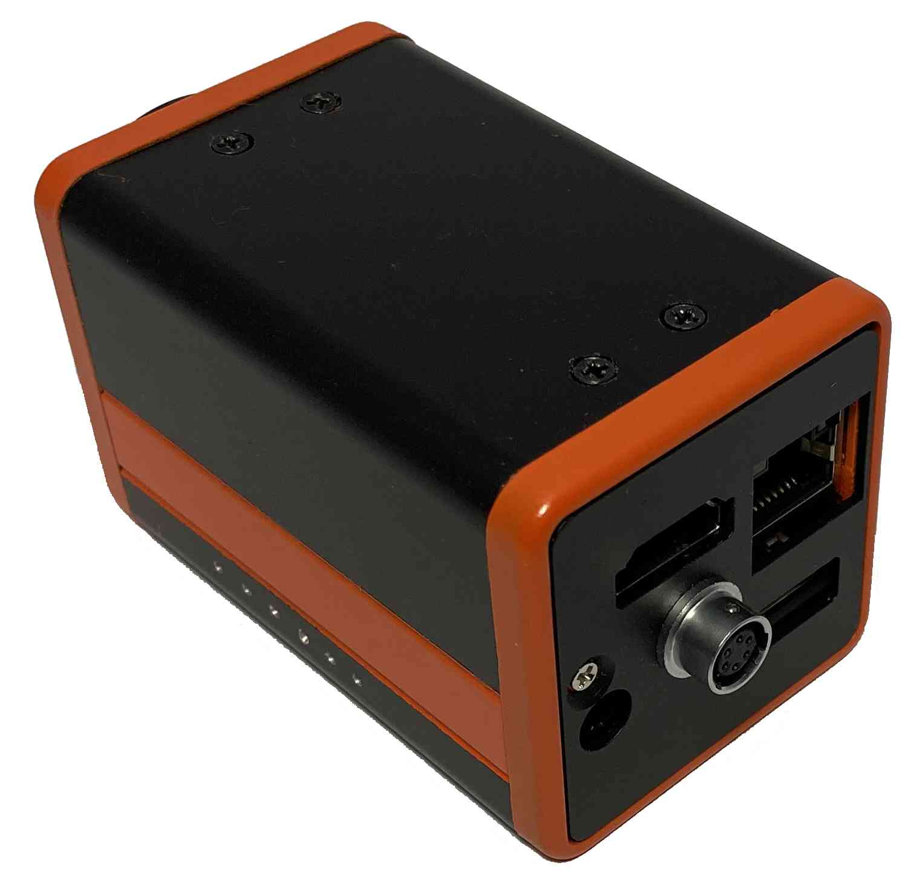pic2-1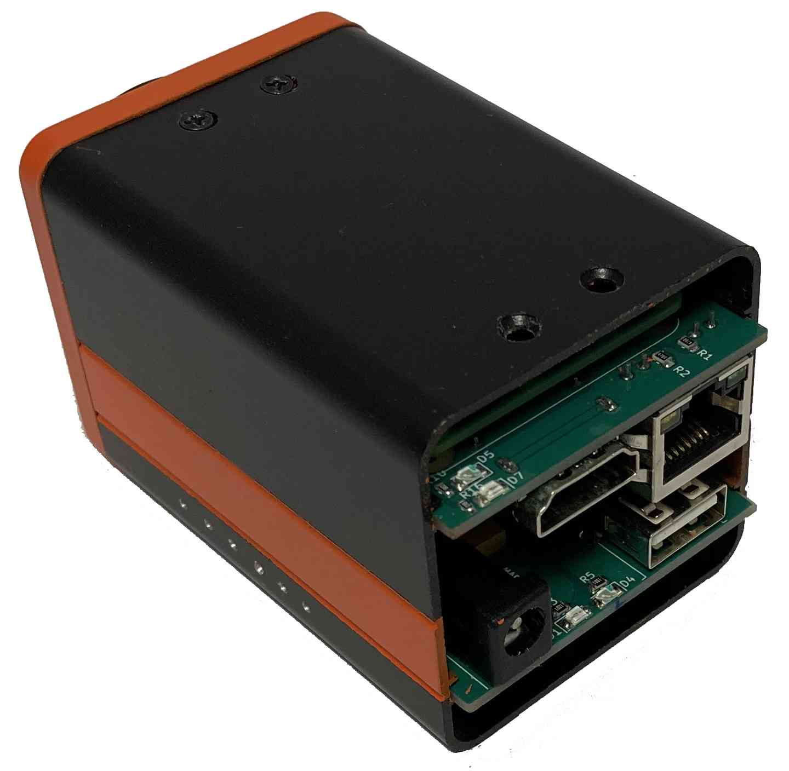pic2-2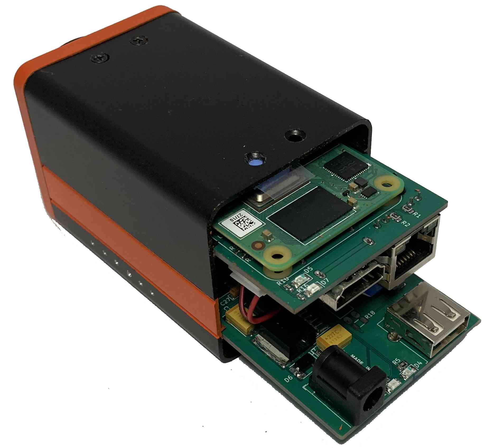 pic2-3

1. Raspberry Pi CM4                     
2. Camera Module (CMOS Image Sensor)
3. Interface and Control Module

We offer 2 major types of Camera Module, the Automatical Focusing and Fixed Focusing. An anti-dust cover had been locked to protect the Automatic Focusing Camera Module, for the Fixed Focusing Module, it needs add-on a C-MOUNT Lens for the Fixed Focusing Camera Module. (see the pic3-1 and pic3-2)

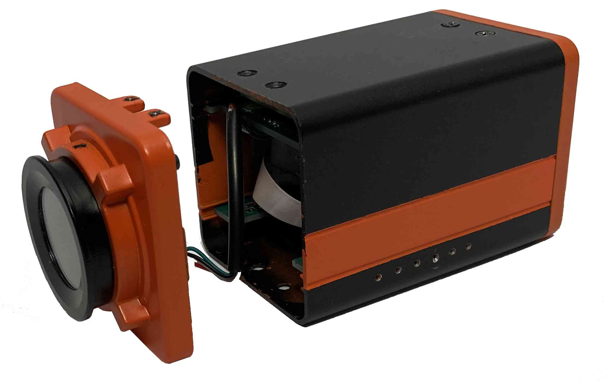   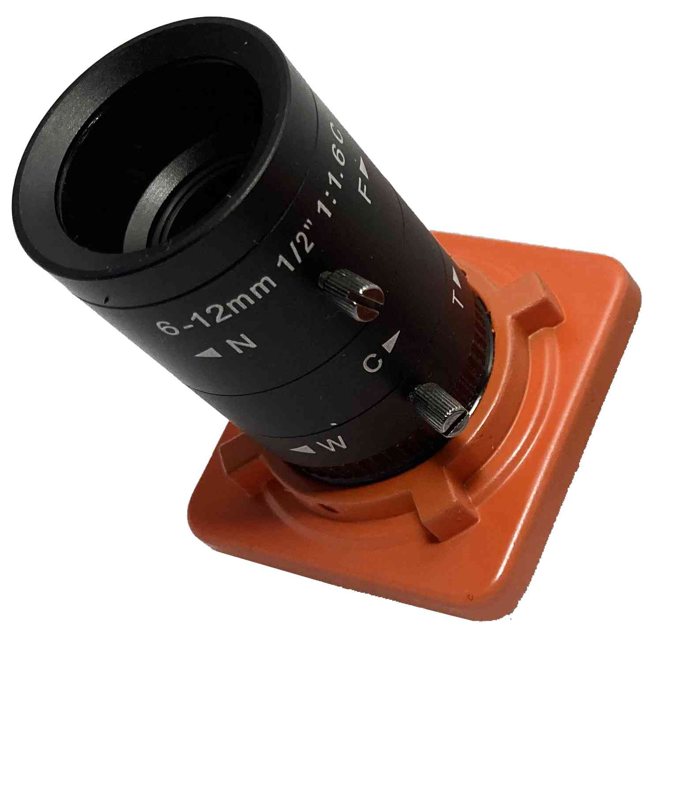 pic3-1    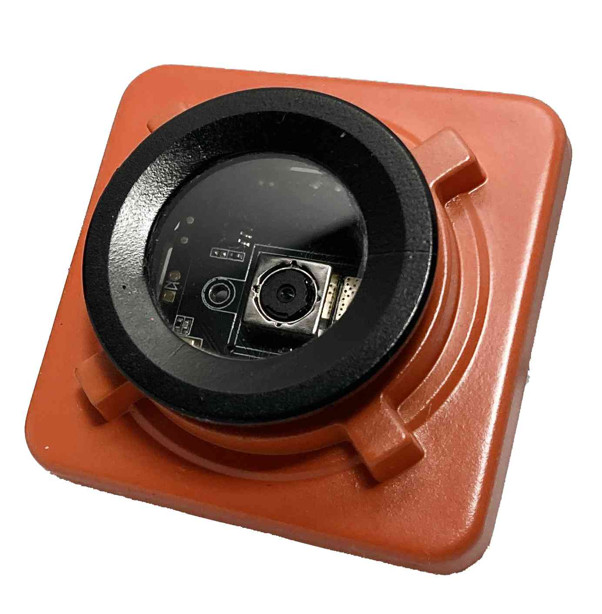 pic3-2

### **●  Build in 3 Vision Applications for automatics usage**
The XISCAM is based on Raspbian Linux OS, and we have built in our Machine Vision Library and Applications. The user can use these applications for his automatic inspection project directly.
We offer the 3 applications such as 'Pattern Searching', 'Pattern Matching' and 'Barcode Scanning'. The booting menu is as followed. (see the pic4-1, pic4-2, pic4-3)

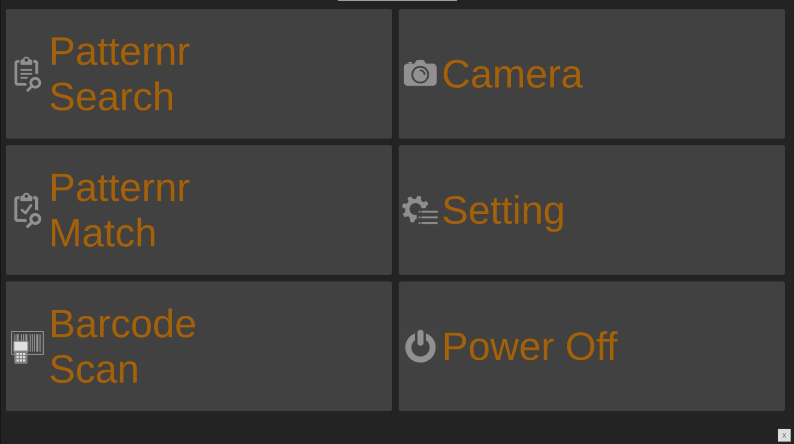 pic4-1

Pattern Searching

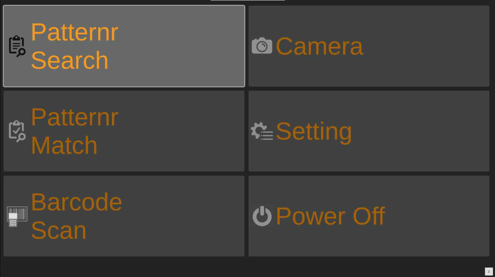 pic4-2  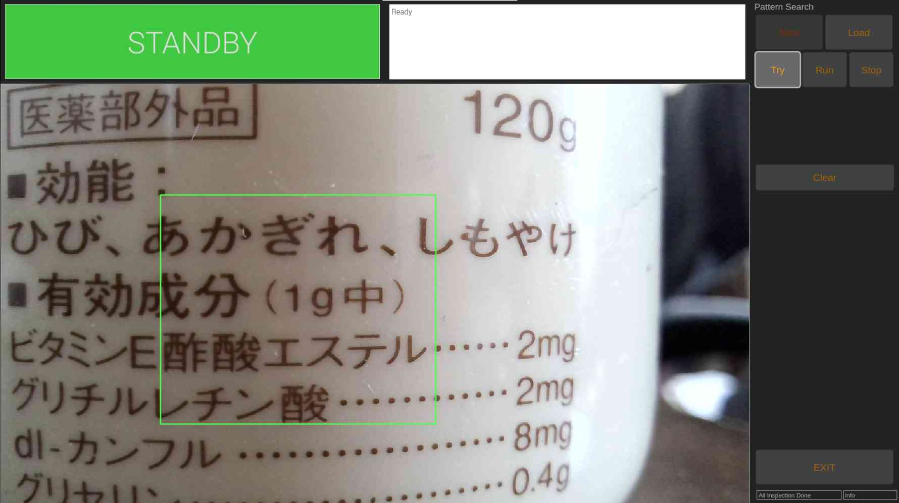

Pattern Matching

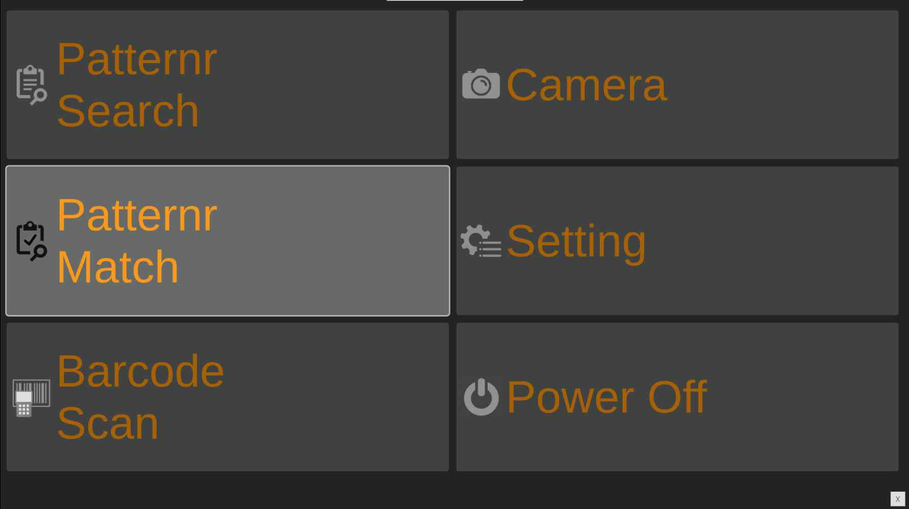 pic4-3   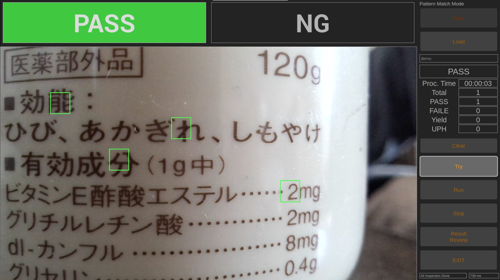

### **●  Other Applications**
For the requirement of Industry 4.0, IoT, AI and Machine Learning, the XISCAM has embedded in the most popular tools and protocals such as Python, Node-RED, MQTT, OPC UA, Modbus, and the over 10,000 softwares on internet what are based on OpenSource GPL3.0 License. It makes XISCAM to be updated easily.

In brief, the XISCAM is a product which packs a camera and a micro computer into a small box then named it 'Integrated Smart CAMera'. 
So any scenario which is related the usage of 'Camera + Computer' such as followed, the XISCAM may will be your quickest, most effective and economic solution.

█ InLine automatic inspection

█ Image processing, measuring

█ Distributed Security and Monitoring System, Image Gateway

█ OnLine tutoring, Live stream

█ Facial Recognition

█ Plate/License Recognition

█ Object detection, Machine Learnning

█ Robotic Vision, Drive-assistance 

### **●  Specifications**

|    Model     |              XISCAM-C70              |                XISCAM-P72                 |                XISCAM-I75                 |                XISCAM-I77                 |
| :----------: | :----------------------------------: | :---------------------------------------: | :---------------------------------------: | :---------------------------------------: |
|              |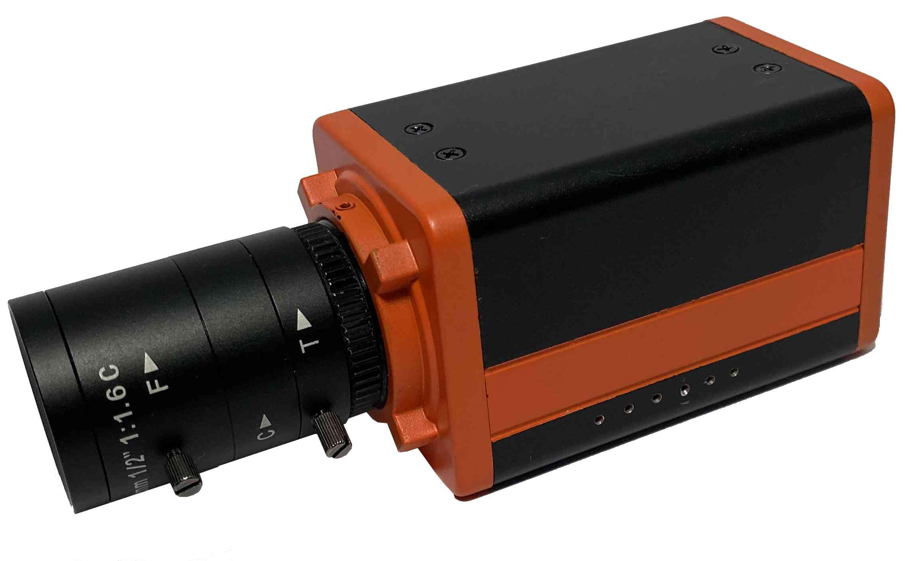|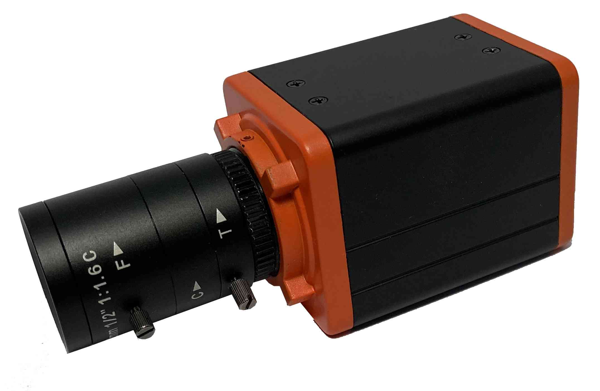|||
|     CPU      | ARM Cortex-A7 (32bit) quad-Core 1GHz | ARM Cortex-A72(v8) 64bit quad-Core 1.5GHz | ARM Cortex-A72(v8) 64bit quad-Core 1.5GHz | ARM Cortex-A72(v8) 64bit quad-Core 1.5GHz |
|     RAM      |             512 Mb DDR3              |                    1G                     |                    2G                     |                    4G                     |
|     LAN      |               10/100M                |           Giga bit Ethernet x1            |           Giga bit Ethernet x1            |           Giga bit Ethernet x1            |
|     WiFi     |          Wi-Fi 802.11b/g/n           |           2.4GHz/5.0GHz 802.11            |           2.4GHz/5.0GHz 802.11            |           2.4GHz/5.0GHz 802.11            |
|    Serial    |                RS485                 |                   RS232                   |                   RS485                   |                   RS485                   |
|      DI      |             2 (max 24V)              |                  2 (5V)                   |                3 (max 24V)                |                3 (max 24V)                |
|      DO      |             4 (max 24V)              |                  4 (5V)                   |                4 (max 24V)                |                4 (max 24V)                |
|     USB      |                  1                   |                     1                     |                     1                     |                     2                     |
|     HDMI     |                  1                   |                     1                     |                     1                     |                     1                     |
|   Storage    |                 16G                  |                    8G                     |                    8G                     |                    16G                    |
|  Dimension   |          50mm X 50mm X 80mm          |            50mm X 50mm X 65mm             |            50mm X 50mm X 80mm             |            50mm X 50mm X 80mm             |
| Power Source |              DC 12~24V               |                   DC 5V                   |                 DC 12~24V                 |                 DC 12~24V                 |

| Camera Model   | CM-A200       | CM-M100       | CM-M200       | CM-M500       |
| -------------- | ------------- | ------------- | ------------- | ------------- |
|                |||||
| Auto-Focusing  | Yes           | No            | No            | No            |
| Lens Interface | ----          | C-MOUNT       | C-MOUNT       | C-MOUNT       |
| Resolution     | 2 Mega Pixels | 1 Mega Pixels | 2 Mega Pixels | 5 Mega Pixels |
| Fps            | 35            | 60            | 35            | 25            |
| Color          | Color         | Black/White   | Color         | Color         |

